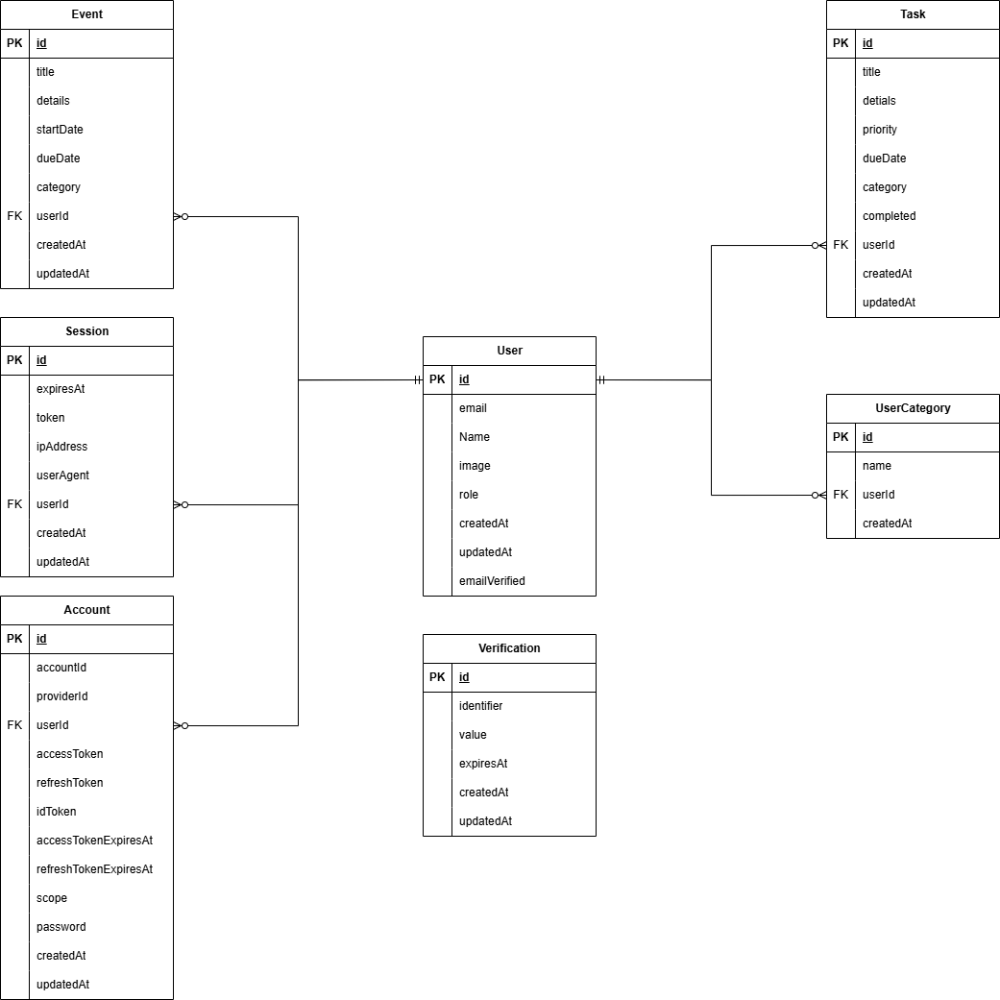

# Final Project – Web Application Development and Security

**Course Code:** COMP6703001  
**Course Name:** Web Application Development and Security  
**Institution:** BINUS University International

---

# 1. Project Information

## Project Title

Study Planner & Productivity Tracker

## Project Domain

Study Planner & Productivity Tracker

## Class

L4AC

## Group Members

| Name     | Student ID | Role                    | GitHub Username |
| -------- | ---------- | ----------------------- | --------------- |
| Member 1 | 2902642726   | Backend Developer      | agiewinata        |
| Member 2 | 2802501123   |Frontend Developer        | Smurfhvr8ght        |
| Member 3 | 2802501060   | AI & Security Developer | LittleDuckTape        |

---

# 2. Instructor & Repository Access

This repository is shared with:

- Instructor: Ida Bagus Kerthyayana Manuaba
    - Email: imanuaba@binus.edu
    - GitHub: bagzcode
- Instructor Assistant: Juwono
    - Email: juwono@binus.edu
    - GitHub: Juwono136

---

# 3. Project Overview

## 3.1 Problem Statement

Many students often struggle to keep track of their task and assignment. In addition to procrastination from being overwhelmed with the quantity of work. While there are methods to help with this issue, most of these solution only offer aid to alliviate one facet of the issue. Stundents who uses these apps have to juggle between multiple apps which may increase their workload instead.

This project aims to solve this issyue by providing a centralized platform for students to organize thier accademic activities and to help improve their productivity

### Target Users

* University students
* High school students
* Self-learners
* Productivity-focused users

## 3.2 Solution Overview

The Study Planner & Productivity Tracker is a full-stack productivity web application that combines task management, calendar scheduling, Pomodoro focus sessions, productivity analytics, and AI-powered study assistance into a single platform.

The application helps users organize their academic responsibilities, track study progress, and receive intelligent recommendations to improve productivity.

### Main Features

* Task Management
* Calendar & Events
* Pomodoro Timer
* Analytics Dashboard
* AI Study Assistant
* Authentication System
* Dragable Dashboard Widgets

### AI Features

* AI Chat Assistant
* Burnout Detection
* Personalized Productivity Recommendations
* Daily AI Affirmations

---

# 4. Technology Stack

| Layer            | Technology         |
| ---------------- | ------------------ |
| Frontend         | Next.js 16         |
| Backend          | Next.js API Routes |
| API              | REST API           |
| Database         | PostgreSQL (Neon) / Firebase (for auth only)  |
| ORM              | Prisma             |
| Authentication   | Better Auth        |
| AI Integration   | Ollama             |
| Styling          | Tailwind CSS       |
| Testing          | Jest               |
| Containerization | Docker             |
| Deployment       | BINUS Server       |
| Version Control  | GitHub             |

---

# 5. System Architecture

## 5.1 Architecture Diagram

```
┌─────────────────────────────────────────────┐
│              Next.js App Router             │
│                                             │
│  app/                                       │
│  ├── (auth)/          # Login, register,    │
│  │                    # forgot password     │
│  ├── dashboard/       # All dashboard pages │
│  │   ├── page.tsx     # Widget grid         │
│  │   ├── tasks/       # Task manager        │
│  │   ├── calendar/    # Full calendar       │
│  │   ├── timer/       # Pomodoro timer      │
│  │   ├── analytics/   # Charts + AI recs    │
│  │   └── ai/          # AI chat             │
│  └── api/             # REST API routes     │
│      ├── tasks/                             │
│      ├── events/                            │
│      ├── categories/                        │
│      ├── analytics/                         │
│      ├── ai/{chat,assess,recs,upload}       │
│      ├── auth/[...all]  # Better-Auth       │
│      └── docs/          # OpenAPI spec      │
│                                             │
│  lib/          # auth, prisma, csrf, etc.   │
│  proxy.ts      # Middleware: CSRF + headers │
└──────────────────────┬──────────────────────┘
                       │
          ┌────────────┴────────────┐
          │                        │
   ┌──────▼──────┐        ┌────────▼────────┐
   │  Neon (PG)  │        │  Ollama (LLM)   │
   │  via Prisma │        │  llama3.1:8b    │
   └─────────────┘        └─────────────────┘
```


## 5.2 Architecture Explanation

The application follows a three-layer architecture consisting of the frontend, backend API, and database.

Users interact with the Next.js frontend, which communicates with REST API endpoints. The API layer handles business logic and accesses PostgreSQL through Prisma ORM.

AI-related requests are processed through Ollama models, which generate chat responses, burnout assessments, productivity recommendations, and daily affirmations.

Security controls such as authentication, authorization, input validation, CSRF protection, and rate limiting are enforced before requests reach the database.

---

# 6. API Design

## 6.1 API Endpoints

| Method | Endpoint                | Description                                                                              | Auth Required |
| ------ | ----------------------- | ---------------------------------------------------------------------------------------- | ------------- |
| GET    | /api/tasks              | Retrieve all tasks and support category filtering                                        | Yes           |
| POST   | /api/tasks              | Create a new task                                                                        | Yes           |
| PATCH  | /api/tasks/{id}         | Update an existing task                                                                  | Yes           |
| DELETE | /api/tasks/{id}         | Delete a task                                                                            | Yes           |
| GET    | /api/categories         | Retrieve all categories                                                                  | Yes           |
| POST   | /api/categories         | Create a new category                                                                    | Yes           |
| DELETE | /api/categories/{id}    | Delete a category and remove category references from related tasks                      | Yes           |
| GET    | /api/events             | Retrieve all calendar events                                                             | Yes           |
| POST   | /api/events             | Create a new event                                                                       | Yes           |
| PATCH  | /api/events/{id}        | Update an existing event                                                                 | Yes           |
| DELETE | /api/events/{id}        | Delete an event                                                                          | Yes           |
| GET    | /api/analytics          | Retrieve task statistics and productivity analytics                                      | Yes           |
| POST   | /api/ai/chat            | Generate AI chat responses                                                               | Yes           |
| POST   | /api/ai/assess          | Perform burnout assessment or generate daily affirmations                                | Yes           |
| POST   | /api/ai/recommendations | Generate personalized productivity recommendations                                       | Yes           |
| POST   | /api/ai/upload          | Upload PDF or text files for AI-assisted study support                                   | Yes           |
| GET    | /api/docs               | Retrieve OpenAPI specification documentation                                             | No            |
| *      | /api/auth/*             | Authentication endpoints including login, registration, password reset, and Google OAuth | No            |

## 6.2 API Documentation

### Swagger Documentation

https://e2526-wads-b4ac-05.csbihub.id/api-docs

### OpenAPI Specification

GET /api/docs

### Example Request

```json
{
  "title": "Finish Assignment",
  "priority": "P1"
}
```

### Example Response

```json
{
  "success": true,
  "message": "Task created successfully"
}
```

---

# 7. Database Design

## 7.1 Database Choice

The project uses PostgreSQL hosted on Neon and managed through Prisma ORM.

PostgreSQL was selected because it provides strong relational database support, reliability, scalability, and seamless integration with Prisma.

## 7.2 Schema / Data Structure

Core Entities:

* User
* Task
* Event
* UserCategory
* Session
* Account
* Verification



---

# 8. AI Features

## 8.1 AI Feature List

| AI Feature                   | Purpose                                    | AI Type        |
| ---------------------------- | ------------------------------------------ | -------------- |
| AI Chat Assistant            | Study assistance and productivity guidance | NLP            |
| Burnout Detection            | Workload analysis                          | NLP            |
| Productivity Recommendations | Personalized study suggestions             | Recommendation |
| Daily Affirmation Generator  | Motivation and encouragement               | NLP            |

## 8.2 AI Integration Flow

**Recomendation, Burnout Detection, and Daily Affirmation:** System compile user task data -> send to Ollama API -> generate response -> Displayed to user

**AI Chatbot:** Input(Text and/or pdf file) -> Ollama API -> generate response -> displayed to user

---

# 9. Security Implementation

## Authentication

The application uses Better Auth for user authentication.

Supported login methods:

* Email and Password
* Google OAuth

Passwords are securely hashed before storage.

## Authorization

Users can only access and modify their own resources.

Ownership checks are performed on every task, category, and event request.

## Input Validation

All incoming requests are validated using Zod schemas.

Invalid requests are rejected before processing.

## Protection Against SQL Injection

Prisma ORM uses parameterized queries and prevents direct SQL execution.

## Protection Against XSS

User input is sanitized before storage and rendering.

Potentially dangerous scripts and HTML content are removed.

## Protection Against CSRF

The application implements a double-submit cookie strategy through middleware.

## Secure API Key Handling

All secrets are stored in environment variables and are never exposed to the users.

---

# 10. Testing Documentation

## 10.1 Frontend Testing

| Test Case | Scenario      | Expected Result  | Status |
| --------- | ------------- | ---------------- | ------ |
| FE-01     | Login Form    | Successful Login | Pass   |
| FE-02     | Invalid Login | Error Displayed  | Pass   |

## 10.2 Backend & API Testing

| Test Case | Endpoint        | Input      | Expected Output | Status |
| --------- | --------------- | ---------- | --------------- | ------ |
| API-01    | POST /api/tasks | Valid Task | Task Created    | Pass   |

The application currently contains 89 automated tests across 9 test suites.

## 10.3 Security Testing

| Test Case | Attack Type   | Expected Behavior | Result |
| --------- | ------------- | ----------------- | ------ |
| SEC-01    | XSS           | Input Sanitized   | Pass   |
| SEC-02    | SQL Injection | Query Blocked     | Pass   |

## 10.4 AI Functionality Testing

### AI Feature: Burnout Detection

| Test Case | Input         | Expected Output | Actual Result | Status |
| --------- | ------------- | --------------- | ------------- | ------ |
| AI-01     | High Workload | Burnout Warning | Correct       | Pass   |
| AI-02     | Low Workload  | No Warning      | Correct       | Pass   |
| AI-03     | Invalid Input | Error Handling  | Correct       | Pass   |

### Failure Handling

* AI timeout handling
* AI unavailable fallback response
* Invalid prompt handling
* Prompt injection mitigation

---

# 11. Deployment & Production Setup

## 11.1 Docker Setup

* Dockerfile Included
* Docker Compose Included

## 11.2 Production Environment

### Secrets Handling

Sensitive credentials are stored as environment variables and are not committed to GitHub.

### HTTPS Configuration

The application is deployed behind HTTPS using the university server infrastructure.

## 11.3 Live Application URL

https://e2526-wads-b4ac-05.csbihub.id

---

# 12. GitHub Contribution Summary

## Student Name: Agie Winata

### Features Implemented

### API Endpoints Handled

### Tests Written

### Security Work

### AI Related Work

## Student Name: Andres Winson

### Features Implemented
* Dashboard Page
* Calendar Page
* Dashboard Widget Components

### API Endpoints Handled
- GET /api/events
- POST /api/events
- PATCH /api/events/{id}
- DELETE /api/events/{id}

### Tests Written
* Tested Widget in dashboard is responsive and is properly displayed
* Tested Dashboard UI dragability
* Confirmed Calendar display is proper and is showing tasks and events
* Tested task creation, editing, and deletion for events

### Security Work
* Implemented event ownerships validation
* Preveting other users from accessing or modifying events owned by other users
* Validation for event API using Zod schema
* Input Sanitization for event creation

### AI Related Work

## Student Name: Irene Angelina
- Focus Session timer
- Short Break Timer
- Long break timer
- Start, Pause, Resume, and Reset controls
- Circular progress indicator
- Customizable timer durations (via timer settings)
- Long break interval configuration (via timer settings)
- Auto-start breaks option (in timer settings)
- Timer completion popup notifications
- Audio alerts when sessions end
- Timer persistence across page navigation (basically timer runs in the background)
- Saved user timer settings

### Features Implemented

### API Endpoints Handled

### Tests Written

### Security Work

### AI Related Work

---

# 13. AI Usage Disclosure

### AI Tools Used

* ChatGPT
* Ollama

### Purpose of Usage

* Code assistance
* Debugging assistance
* AI feature implementation
* Testing scenario generation

### Assisted Components

* Backend API development
* AI integration
* Documentation assistance

---

# 14. Known Limitations & Future Improvements

## Current Limitations

* Requires Ollama availability
* AI recommendations depend on available user data

## Future Improvements

* Mobile application
* Team collaboration support
* More advanced scheduling algorithms

## AI Risks & Limitations

* AI responses may be inaccurate
* Recommendations should be treated as suggestions

---

# 15. Final Declaration

We declare that:

* This project is our own work.
* AI usage has been disclosed honestly.
* All group members understand the system.

Signed by Group Members:

* Agie Winata
* Andres Winson
* Irene Angelina

---

# 16. Setup

```bash
git clone https://github.com/agiewinata/Wads-Final

cd Wads-Final

npm install

npm run dev
```

---

# 17. Deployment Instructions

```bash
docker compose up --build -d
```

### Manual Deployment

```bash
git pull origin Main

docker compose down

docker compose up --build -d
```
